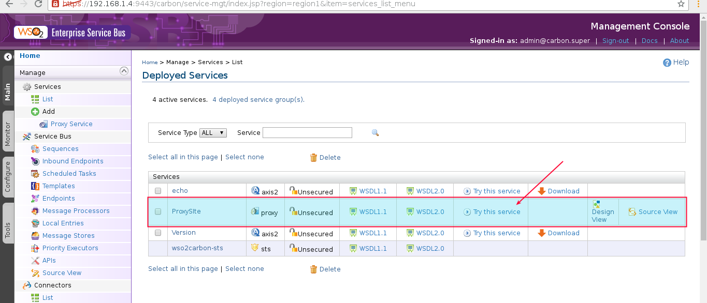

Crear con WSO2 ESB un Proxy WSDL
================================

Vamos a utilizar en el WSO2 ESB especificamente "WSDL Based Proxy" el cual crea un servicio proxy hacia un WSDL existente en un Web Services. La informacion del Endpoint es extraida desde el host remoto en donde esta publicado el WSDL de ese servicio actual.

Utilizaremos este domino el cual publica WS de forma publica "http://www.webservicex.net/new/Home/Index" 

en este ejemplo utilizaremos el WS que nos ayuda a consultar un Dominio "WhoIs" "http://www.webservicex.net/New/Home/ServiceDetail/52" en este link esta publicado el Endpoint. "http://www.webservicex.net/whois.asmx?WSDL"

Consultamos el Endpoint y podremos ver el contrato completo

Ya con los datos del WSDL que utilizaremos, nos vamos a la consola del ESB y en Main, Services, Add, Proxy Service y seleccionamos "WSDL Based Proxy"

Llenamos los siguientes campos obligatorios
* Proxy Service Name	Este es un nombre representativo del WSDL
*WSDL URI			Esta es la URL del Endpoint
*WSDL Service		Lo buscamos en le contrato el service name que necesitamos
*WSDL Port			Lo buscamos en le contrato en el port name
*Publish Same Service Contract	Y este lo tildamos.

Veamos de donde sacamos WSDL Service y WSDL Port

Llenamos los campos y lo creamos.

Ya podemos ver nuestro proxy creado y vamos a probarlo.

.. figure:: ../images/esb/08.png

Ahora veamos la configuracion y vamos a consultar el Endpoint desde el proxy

Nos copiamos el Endpoint que el proxy publica y lo consultamos en un navegador o en el SoapUI

