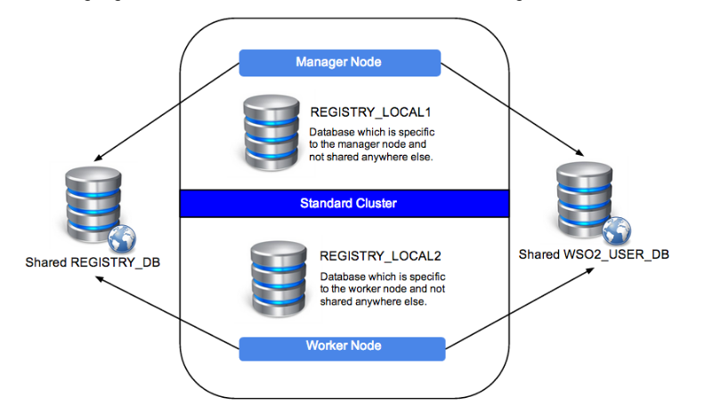

Instalar ESB en Cluster
======================

Toda esta informacion es de la pagina oficial de WSO2 para ESB y estamos utilizando WSO2 ESB 4.9.0 

Esta seccion describe como se configura WSO2 ESB worker/manager separados en un cluster. La siguiente seccion le suministra informacion e instrucciones de como configurar el cluster.

IMPORTANTE: cuando configure productos WSO2 en cluster, es necesario que use una IP en especifico y no localhost o el nombre DNS del Host en las configuraciones. 

Worker/manager Separados en cluster
+++++++++++++++++++++++++++++++++++

En esta parte hay tres WSO2 ESB nodes, un nodo actua como manager y los otros dos nodos actuan como worker para la alta disponibilidad y servir los servicios para los requests. En esta parte, permitiremos el acceso a la consola admin a traves de un load balancer al manager. Adicionalmente los servicios de requests estaran direccionados a los nodos workers a traves del load balancer. la siguiente imagen explica las partes del despliegue del esenario del cluster que seguiremos.

.. figure:: ../images/esb/20.png

Aqui usamos dos nodos com conocidos como miembros, un como manager y los otros dos como nodos worker. Esto siempre es recomendado usar

Tenga en mente:
Los pasos de configuracion de este documento asumen que el default es el puerto 80 y 443 por el load balancer para este WSO2 ESB cluster. Si algun otro puerto es usado distintos a los defaults, remplace los puertos correspondientes.

Ya con lo de arriba en mente, tome en cuenta lo siguiente:
Los puertos en el Load balancer son el 80 y 443 indicados para el despliegue.
Los Requests HTTP hacia los nodos worker usan http://xxx.xxx.xxx.xx3/<service> via HTTP 80 port.
Los Requests HTTPS hacia los nodos worker usan https://xxx.xxx.xxx.xx3/<service> via HTTPS 443 port.
El acceso a la consola del Manager es por https://xxx.xxx.xxx.xx2/carbon via HTTPS 443 port
En WSO2 ESB cluster, la direccion de servicio de los Requests en los nodos worker para el PassThrough se hace por los puertos (8280 and 8243) y se puede haceder al Management Console usando el HTTPS 9443 port.

Crear los certificados SSL
++++++++++++++++++++++++++

Crear los certificados SSL para el manager y los nodos worker::

	Create the Server Key.
	$sudo openssl genrsa -des3 -out server.key 1024

	Certificate Signing Request.
	$sudo openssl req -new -key server.key -out server.csr

	Remove the password.
	$sudo cp server.key server.key.org

	$sudo openssl rsa -in server.key.org -out server.key
	Sign your SSL Certificate.

	$sudo openssl x509 -req -days 365 -in server.csr -signkey server.key -out server.crt

Mientras este creando las Keys, coloque el nombre del Host (esb.wso2.com or mgt.esb.wso2.com) como el del common name.

Configurar la Base de Datos
++++++++++++++++++++++++++++

La siguiente informacion es de como configura la Base de Datos para el cluster. La configuracion del datasource debe ser realizada en el archivo <PRODUCT_HOME>/repository/conf/datasources/master-datasources.xml para el manager y los nodos worker. Se puede tener configurado una base de datos para el shared registry y sus detalles se deben realizar en el archivo <PRODUCT_HOME>/repository/conf/registry.xml

Cada producto de Carbon-based usa una base de datos para almacenar informacion tal como user management details and registry data. Todos los nodos del cluster usa una base de datos central para la configuracion y registros de gobiernos montados. Asumimos que instalara MySQL como su relational database management system (RDBMS), pero se puede utilizar otra RDBMS que se requiera.

H2 no es recomendada en produccion.
H2 es la base de datos que viene con WSO2 pero no es recomendada en ambientes de produccion. Tiene muy bajo performance, limitacion de cluster y puede causar fallas en los archivos. Utilice una RDBMS como Oracle, PostgreSQL, MySQL, o MS SQL.

Puede usar la base de datos H2 para ambientes de desarrollo y como local registry en un registry mount.

Puede crear las siguientes base de datos y asociarlas a los datasources.

Database Name	Description

- **REGISTRY_DB**		Shared database for config and governance registry mounts in the product's nodes

- **REGISTRY_LOCAL1**	Local registry space in the manager node

- **REGISTRY_LOCAL2**	Local registry space in the worker node

- **WSO2_USER_DB**		JDBC user store and authorization manager

El siguiente diagrama ilustra como estas base de datos estan conectadas con el manager y los nodos worker.

Los siguientes topicos nos guiaran por todas las configuraciones necesarias para la configuracion de la base de datos para el cluster.
- Creando las base de datos
- Configurar SVN-Based Deployment Synchronizer
- Configurando el nodo manager
- Configurando los nodos worker
- Montando el registro en el manager y los nodos worker

Creando las base de datos
+++++++++++++++++++++++++++

1. Descarga e instalacion de MySQL server.
2. Descarga del driver MySQL JDBC.
3. Descomprimir el archivo del driver MySQL JDBC (mysql-connector-java-x.x.xx-bin.jar) y copiarlo dentro del directorio <PRODUCT_HOME>/repository/components/lib en el manager y los nodos worker.
4. Definir un nombre host para la configuracion de permisos de la base de datos, en le archivo /etc/hosts y agregar la siguiente linea:
<MYSQL-DB-SERVER-IP> carbondb.mysql-wso2.com
Este paso solo se debe hacer si la base de datos no esta en la maquina local y esta en un servidor separado.
5. Coloque el siguiente comando en el terminal para acceder a la base de datos:
mysql -u username -p
6. Cuando pregunte la clave, coloque la asignada para dicho usuario.
7. Cree las base de datos usando los siguientes comandos, donde <PRODUCT_HOME> es el path en donde tiene instalado el producto de WSO2 y el username y password son los mismos utilizados en el paso previo.::

	mysql> create database WSO2_USER_DB;
	mysql> use WSO2_USER_DB;
	mysql> source <PRODUCT_HOME>/dbscripts/mysql.sql;
	mysql> source <PRODUCT_HOME>/dbscripts/identity/mysql.sql;
	mysql> grant all on WSO2_USER_DB.* TO regadmin@"carbondb.mysql-wso2.com" identified by "regadmin";
	 
	mysql> create database REGISTRY_DB;
	mysql> use REGISTRY_DB;
	mysql> source <PRODUCT_HOME>/dbscripts/mysql.sql;
	mysql> grant all on REGISTRY_DB.* TO regadmin@"carbondb.mysql-wso2.com" identified by "regadmin";
	 
	mysql> create database REGISTRY_LOCAL1;
	mysql> use REGISTRY_LOCAL1;
	mysql> source <PRODUCT_HOME>/dbscripts/mysql.sql;
	mysql> grant all on REGISTRY_LOCAL1.* TO regadmin@"carbondb.mysql-wso2.com" identified by "regadmin";
	  
	mysql> create database REGISTRY_LOCAL2;
	mysql> use REGISTRY_LOCAL2;
	mysql> source <PRODUCT_HOME>/dbscripts/mysql.sql;
	mysql> grant all on REGISTRY_LOCAL2.* TO regadmin@"carbondb.mysql-wso2.com" identified by "regadmin";

NOTA: Si quiere que esto sea automatico la creacion de las base de datos, durante la inicializacion del servidor coloque el parametro -Dsetup y este hara que sean llamado los dbscripts para que hagan esta actividad.
Tambien tome en cuenta o busque informacion en la pagina de WSO2 si va utilizar MySQL 5.7, porque solo es recomendado para productos basados en carbon 4.4.6 o versiones anteriores.

Configurando el nodo manager
++++++++++++++++++++++++++++

Hacer la siguiente configuracion para el nodo manager del cluster.

1. En le nodo manager, abra el archivo <PRODUCT_HOME>/repository/conf/datasources/master-datasource.xml y configure los datasources para las base de datos REGISTRY_LOCAL1, WSO2_REGISTRY_DB, and WSO2_USER_DB como se muestra a continuacion.::

	<datasources-configuration xmlns:svns="http://org.wso2.securevault/configuration">
		 <providers>
		    <provider>org.wso2.carbon.ndatasource.rdbms.RDBMSDataSourceReader</provider>
		</providers>
		<datasources>
		    <datasource>
		        <name>REGISTRY_LOCAL1</name>
		        <description>The datasource used for registry- local</description>
		        <jndiConfig>
		            <name>jdbc/WSO2CarbonDB</name>
		        </jndiConfig>
		        <definition type="RDBMS">
		            <configuration>
		                <url>jdbc:mysql://carbondb.mysql-wso2.com:3306/REGISTRY_LOCAL1?autoReconnect=true</url>
		                <username>regadmin</username>
		                <password>regadmin</password>
		                <driverClassName>com.mysql.jdbc.Driver</driverClassName>
		                <maxActive>50</maxActive>
		                <maxWait>60000</maxWait>
		                <testOnBorrow>true</testOnBorrow>
		                <validationQuery>SELECT 1</validationQuery>
		                <validationInterval>30000</validationInterval>
		            </configuration>
		        </definition>
		    </datasource>
		    <datasource>
		        <name>REGISTRY_DB</name>
		        <description>The datasource used for registry- config/governance</description>
		        <jndiConfig>
		            <name>jdbc/WSO2RegistryDB</name>
		        </jndiConfig>
		        <definition type="RDBMS">
		            <configuration>
		                <url>jdbc:mysql://carbondb.mysql-wso2.com:3306/REGISTRY_DB?autoReconnect=true</url>
		                <username>regadmin</username>
		                <password>regadmin</password>
		                <driverClassName>com.mysql.jdbc.Driver</driverClassName>
		                <maxActive>50</maxActive>
		                <maxWait>60000</maxWait>
		                <testOnBorrow>true</testOnBorrow>
		                <validationQuery>SELECT 1</validationQuery>
		                <validationInterval>30000</validationInterval>
		            </configuration>
		        </definition>
		    </datasource>
		     <datasource>
		        <name>WSO2_USER_DB</name>
		        <description>The datasource used for registry and user manager</description>
		        <jndiConfig>
		            <name>jdbc/WSO2UMDB</name>
		        </jndiConfig>
		        <definition type="RDBMS">
		            <configuration>
		                <url>jdbc:mysql://carbondb.mysql-wso2.com:3306/WSO2_USER_DB</url>
		                <username>regadmin</username>
		                <password>regadmin</password>
		                <driverClassName>com.mysql.jdbc.Driver</driverClassName>
		                <maxActive>50</maxActive>
		                <maxWait>60000</maxWait>
		                <testOnBorrow>true</testOnBorrow>
		                <validationQuery>SELECT 1</validationQuery>
		                <validationInterval>30000</validationInterval>
		            </configuration>
		        </definition>
		    </datasource>
	   </datasources>
	</datasources-configuration>

2. Para configurar el user datasource, actualice la propiedad del datasource en el archivo <PRODUCT_HOME>/repository/conf/user-mgt.xml en el nodo **manger**.::

	<Property name="dataSource">jdbc/WSO2UMDB</Property>

3. Tambien puede actualizar la propiedad del datasource en el archivo <PRODUCT_HOME>/repository/conf/registry.xml en el nodos **manager**.::

	<dbConfig name="sharedregistry">   
		<dataSource>jdbc/WSO2RegistryDB</dataSource>
	</dbConfig>

Configurando los nodos worker
+++++++++++++++++++++++++++++

Hacer la siguiente configuracion para en los nodos worker del cluster.

1. En los nodos worker, abra el archivo <PRODUCT_HOME>/repository/conf/datasources/master-datasource.xml y configure los datasources para las base de datos REGISTRY_LOCAL1, WSO2_REGISTRY_DB, and WSO2_USER_DB como se muestra a continuacion.::

	<datasources-configuration xmlns:svns="http://org.wso2.securevault/configuration">
		 <providers>
		    <provider>org.wso2.carbon.ndatasource.rdbms.RDBMSDataSourceReader</provider>
		</providers>
		<datasources>
		    <datasource>
		        <name>REGISTRY_LOCAL2</name>
		        <description>The datasource used for registry- local</description>
		        <jndiConfig>
		            <name>jdbc/WSO2CarbonDB</name>
		        </jndiConfig>
		        <definition type="RDBMS">
		            <configuration>
		                <url>jdbc:mysql://carbondb.mysql-wso2.com:3306/REGISTRY_LOCAL2?autoReconnect=true</url>
		                <username>regadmin</username>
		                <password>regadmin</password>
		                <driverClassName>com.mysql.jdbc.Driver</driverClassName>
		                <maxActive>50</maxActive>
		                <maxWait>60000</maxWait>
		                <testOnBorrow>true</testOnBorrow>
		                <validationQuery>SELECT 1</validationQuery>
		                <validationInterval>30000</validationInterval>
		            </configuration>
		        </definition>
		    </datasource>
		    <datasource>
		        <name>REGISTRY_DB</name>
		        <description>The datasource used for registry- config/governance</description>
		        <jndiConfig>
		            <name>jdbc/WSO2RegistryDB</name>
		        </jndiConfig>
		        <definition type="RDBMS">
		            <configuration>
		                <url>jdbc:mysql://carbondb.mysql-wso2.com:3306/REGISTRY_DB?autoReconnect=true</url>
		                <username>regadmin</username>
		                <password>regadmin</password>
		                <driverClassName>com.mysql.jdbc.Driver</driverClassName>
		                <maxActive>50</maxActive>
		                <maxWait>60000</maxWait>
		                <testOnBorrow>true</testOnBorrow>
		                <validationQuery>SELECT 1</validationQuery>
		                <validationInterval>30000</validationInterval>
		            </configuration>
		        </definition>
		    </datasource>
		     <datasource>
		        <name>WSO2_USER_DB</name>
		        <description>The datasource used for registry and user manager</description>
		        <jndiConfig>
		            <name>jdbc/WSO2UMDB</name>
		        </jndiConfig>
		        <definition type="RDBMS">
		            <configuration>
		                <url>jdbc:mysql://carbondb.mysql-wso2.com:3306/WSO2_USER_DB</url>
		                <username>regadmin</username>
		                <password>regadmin</password>
		                <driverClassName>com.mysql.jdbc.Driver</driverClassName>
		                <maxActive>50</maxActive>
		                <maxWait>60000</maxWait>
		                <testOnBorrow>true</testOnBorrow>
		                <validationQuery>SELECT 1</validationQuery>
		                <validationInterval>30000</validationInterval>
		            </configuration>
		        </definition>
		    </datasource>
	   </datasources>
	</datasources-configuration>

2. Para configurar el user datasource, actualice la propiedad del datasource en el archivo <PRODUCT_HOME>/repository/conf/user-mgt.xml en los nodos **worker**.::

	<Property name="dataSource">jdbc/WSO2UMDB</Property>

3. Tambien puede actualizar la propiedad del registro datasource en el archivo <PRODUCT_HOME>/repository/conf/registry.xml en los nodos **worker**.::

	<dbConfig name="sharedregistry">   
		<dataSource>jdbc/WSO2RegistryDB</dataSource>
	</dbConfig>

Montando el registro en el manager y los nodos worker
++++++++++++++++++++++++++++++++++++++++++++++++++++++

Necesitamos en este paso estar seguros que el shared registry para governance y la configuracion este montada en ambos nodos. Esta base de datos es la REGISTRY_DB.

Configure la base de datos shared registry y monte los detalles en el archivo <PRODUCT_HOME>/repository/conf/registry.xml en el nodo **manager** como se muestra a continuacion.

Note: El existente dbConfig llamado wso2registry no debe ser removido cuando se agregen las siguientes configuraciones.::

	<dbConfig name="sharedregistry">
		<dataSource>jdbc/WSO2RegistryDB</dataSource>
	</dbConfig>
	 
	<remoteInstance url="https://localhost:9443/registry">
		<id>instanceid</id>
		<dbConfig>sharedregistry</dbConfig>
		<readOnly>false</readOnly>
		<enableCache>true</enableCache>
		<registryRoot>/</registryRoot>
		<cacheId>regadmin@jdbc:mysql://carbondb.mysql-wso2.com:3306/REGISTRY_DB?autoReconnect=true</cacheId>
	</remoteInstance>
	 
	<mount path="/_system/config" overwrite="true">
		<instanceId>instanceid</instanceId>
		<targetPath>/_system/config</targetPath>
	</mount>
	 
	<mount path="/_system/governance" overwrite="true">
		<instanceId>instanceid</instanceId>
		<targetPath>/_system/governance</targetPath>
	</mount>

Configure la base de datos shared registry y monte los detalles en el archivo <PRODUCT_HOME>/repository/conf/registry.xml en los nodos **worker** como se muestra a continuacion.::

	<dbConfig name="sharedregistry">
		<dataSource>jdbc/WSO2RegistryDB</dataSource>
	</dbConfig>
	 
	<remoteInstance url="https://localhost:9443/registry">
		<id>instanceid</id>
		<dbConfig>sharedregistry</dbConfig>
		<readOnly>true</readOnly>
		<enableCache>true</enableCache>
		<registryRoot>/</registryRoot>
		<cacheId>regadmin@jdbc:mysql://carbondb.mysql-wso2.com:3306/REGISTRY_DB?autoReconnect=true</cacheId>
	</remoteInstance>
	 
	<mount path="/_system/config" overwrite="true">
		<instanceId>instanceid</instanceId>
		<targetPath>/_system/config</targetPath>
	</mount>
	 
	<mount path="/_system/governance" overwrite="true">
		<instanceId>instanceid</instanceId>
		<targetPath>/_system/governance</targetPath>
	</mount>

The following are some key points to note when adding these configurations:
The dataSource you specify under the <dbConfig name="sharedregistry"> tag must match the jndiConfig name specified in the master-datasources.xml file of the manager and worker.
The registry mount path is used to identify the type of registry. For example, ”/_system/config” refers to configuration registry, and "/_system/governance" refers to the governance registry.
The dbconfig entry enables you to identify the datasource you configured in the master-datasources.xml file. We use the unique name sharedregistry to refer to that datasource entry. 
The remoteInstance section refers to an external registry mount. We can specify the read-only/read-write nature of this instance as well as caching configurations and the registry root location. In case of a worker node, the readOnly property should be true, and in case of a manager node, this property should be set to false. 
Additionally, we must specify cacheId, which enables caching to function properly in the clustered environment. Note that cacheId is the same as the JDBC connection URL of the registry database. This value is the cacheId of the remote instance. Here the cacheId should be in the format of $database_username@$database_url, where $database_username is the username of the remote instance database and $database_url is the remote instance database URL. This cacheID is used to identify the cache it should look for when caching is enabled. In this case, the database we should connect to is REGISTRY_DB, which is the database shared across all the master/workers nodes. You can identify that by looking in the mounting configurations, where the same datasource is being used.
You must define a unique name “id” for each remote instance, which is then referred to from mount configurations. In the above example, the unique ID for the remote instance is instanceId. 
In each of the mounting configurations, we specify the actual mount path and target mount path. The targetPath can be any meaningful name. In this instance, it is /_system/config.
Now your database is set up.

Configurar SVN-Based Deployment Synchronizer
++++++++++++++++++++++++++++++++++++++++++++

En esta seccion se describe como configurar el DepSync repository in Subversion (SVN). DepSync puede usar el Subversion instalado en el servidor, esto no es recomendado por WSO2 en produccion. Utilice el SVNKit que describe los pasos a seguir. Ver http://www.if-not-true-then-false.com/2010/install-svn-subversion-server-on-fedora-centos-red-hat-rhel/.

Los siguientes pasos ayuda a configurar el SVN Repository.

1. Descargar e instalar el SVNKit desde http://product-dist.wso2.com/tools/svnkit-all-1.8.7.wso2v1.jar en la carpeta the <PRODUCT_HOME>/repository/components/dropins.
2. Descargar http://maven.wso2.org/nexus/content/groups/wso2-public/com/trilead/trilead-ssh2/1.0.0-build215/trilead-ssh2-1.0.0-build215.jar  y copiarla en la carpeta <PRODUCT_HOME>/repository/components/lib. Este .jar es necesario para el trabajo de SVNKi
3. En una consola, escribir el siguiente comando para crear el nuevo repositorio:
svnadmin create <PathToRepository>/<RepoName> 

Por ejemplo::

	svnadmin create ~/depsyncrepo
4. Abra <PathToRepository>/<RepoName>/conf/svnserve.conf y configure las siguientes lineas de autenticacion para el nuevo repositorio.
anon-access = none         (Specifies what kind of access anonymous users have; in this case, none)
auth-access = write       (Specifies what authenticated users can do; in this case, they can write, which also includes reading) 
password-db = passwd     (Specifies the source of authentication; in this case, the file named passwd, which resides in the same directory as svnserve.conf)
5. Abra <PathToRepository>/<RepoName>/conf/passwd y agregue las siguientes lineas en el formato de  <username>:<password>  para agregar un nuevo usuario:
repouser:repopassword

Despues de crear el repositorio, el siguiente paso es habilitar el DepSync en el manager y los nodos worker.

Habilitando el DepSync en el nodo manager
+++++++++++++++++++++++++++++++++++++++++

Cunfigurar DepSync en el archivo <PRODUCT_HOME>/repository/conf/carbon.xml del nodo manager para aplicar los siguientes cambios en el tag de <DeploymentSynchronizer>:

1. Habilitar la caracteristica DepSync: <Enabled>true</Enabled>
2. Habilitar el Autocommit para el repositorio local cuando existan cambios en el repositorio central. (Solo se habilita en el nodo manager.): <AutoCommit>true</AutoCommit>
3. Automaticamente actualizar el repositorio local cuando existan cambios en el repositorio central: <AutoCheckout>true</AutoCheckout>
4. Especificar el tipo de repositorio (En este caso Subversion): <RepositoryType>svn</RepositoryType>
5. Especificar donde esta el repositorio y cual es el protocolo de acceso: <SvnUrl><AccessProtocol>://<PathToRepository>/<RepoName>/</SvnUrl>
6. Especificar el usuario definido en la anterior seccion: <SvnUser>repouser</SvnUser>
7. Especificar el passwor definio en la anterior seccion: <SvnPassword>repopassword</SvnPassword>
8. Habilitar la configuracion de tenant-specific si se necesita:<SvnUrlAppendTenantId>true</SvnUrlAppendTenantId>

Al final la configuracion para el nodo management quedaria asi::

	<DeploymentSynchronizer>
		<Enabled>true</Enabled>
		<AutoCommit>true</AutoCommit>
		<AutoCheckout>true</AutoCheckout>
		<RepositoryType>svn</RepositoryType>
		<SvnUrl>https://svn.example.com/depsync.repo/</SvnUrl>
		<SvnUser>repouser</SvnUser>
		<SvnPassword>repopassword</SvnPassword>
		<SvnUrlAppendTenantId>true</SvnUrlAppendTenantId>
	</DeploymentSynchronizer>

Ahora que ya esta completo el nodo manager, vamos con la configuracion en los nodos worker

Habilitando el DepSync en los nodos worker
+++++++++++++++++++++++++++++++++++++++++

Habilite el DepSync en los nodos worker del mismo modo que en el nodo manager, solo con un cambio: setear <AutoCommit>false</AutoCommit>, los nodos worker no manejan los requests.::

	<DeploymentSynchronizer>
		<Enabled>true</Enabled>
		<AutoCommit>false</AutoCommit>
		<AutoCheckout>true</AutoCheckout>
		<RepositoryType>svn</RepositoryType>
		<SvnUrl>https://svn.example.com/depsync.repo/</SvnUrl>
		<SvnUser>repouser</SvnUser>
		<SvnPassword>repopassword</SvnPassword>
		<SvnUrlAppendTenantId>true</SvnUrlAppendTenantId>
	</DeploymentSynchronizer>

Ya tenemos la configuracion de DepSync para el cluster, con esto se asegura que todos los nodos del cluster tengan la misma configuracion.

Configuracion del nodo Manager
+++++++++++++++++++++++++++++++

1. Descargar y descomprimir el WSO2 ESB, considerar de extraerlo como <PRODUCT_HOME>
2. Establecer las configuraciones del cluster. Editar el archivo <PRODUCT_HOME>/repository/conf/axis2/axis2.xml.

	a. Habilitar el cluster para los nodos
	<clustering class="org.wso2.carbon.core.clustering.hazelcast.HazelcastClusteringAgent" enable="true">
	b. Establecer el schema de miembro para el wka que habilitar el registro de las direcciones conocidas (Este nodo envia la inicializacion del cluster a todos los miembros WKA que definiremos luego)
	<parameter name="membershipScheme">wka</parameter>
	c. Especificar el nombre del cluster que este nodo se unira.
	<parameter name="domain">wso2.esb.domain</parameter>
	d. Especificar el host que se comunicara con los mensajes del cluster
	<parameter name="localMemberHost">xxx.xxx.xxx.xx2</parameter>
	e. Especificar el puerto a usar para la comunicacion de los mensajes del cluster. Este puerto no es afectado por la configuracion offset en el archivo <PRODUCT_HOME>/repository/conf/carbon.xml. Si este puerto ya esta asignado a otro server, el cluster automaticamente incrementa este puerto. Como sea, si dos server estan corriendo en la misma maquina, deberia estar seguro que se utilice un unico puerto para cada servidor.
	<parameter name="localMemberPort">4100</parameter>
	f. Especifique los miembros conocidos. en este ejemplo los miembros conocidos son los nodos worker. El valor del puerto para el WKA del nodo worker debe ser el mismo valor localMemberPort (en este caso 4200).
::

	<members>
	  <member>
		 <hostName>xxx.xxx.xxx.xx3</hostName>
		  <port>4200</port>
	  </member>
	</members>

	g. Cambiar las siguientes propiedades del cluster. Este seguro que el valor del subDomain sea **mgt** para especificar que este es el nodo manager. Esto asegura que el trafico para el nodo manager sea enrutado a este miembro.
::

	<parameter name="properties">
		        <property name="backendServerURL" value="https://${hostName}:${httpsPort}/services/"/>
		        <property name="mgtConsoleURL" value="https://${hostName}:${httpsPort}/"/>
		        <property name="subDomain" value="mgt"/>
	</parameter>

3. Configure el hostName, para hacer esto, edite el archivo  <PRODUCT_HOME>/repository/conf/carbon.xm.::

	<HostName>esb.wso2.com</HostName>
	<MgtHostName>mgt.esb.wso2.com</MgtHostName>

4. Habilitar SVN-based deployment synchronization con la propiedad AutoCommit en true. para hacer esto, edite el archivo <PRODUCT_HOME>/repository/conf/carbon.xml.::

	<DeploymentSynchronizer>
		<Enabled>true</Enabled>
		<AutoCommit>true</AutoCommit>
		<AutoCheckout>true</AutoCheckout>
		<RepositoryType>svn</RepositoryType>
		<SvnUrl>https://svn.wso2.org/repos/esb</SvnUrl>
		<SvnUser>svnuser</SvnUser>
		<SvnPassword>xxxxxx</SvnPassword>
		<SvnUrlAppendTenantId>true</SvnUrlAppendTenantId>
	</DeploymentSynchronizer>

5. En el archivo <PRODUCT_HOME>/repository/conf/carbon.xml se puede especificar el valor del puerto offset. Esto es solo aplicable si tiene multiples productos WSO2 instalados en el servidor ::

	<Ports>
		...
		<Offset>0</Offset>
		...
	</Ports>

6. Mapear el nombre del host a la IP. Agregue los host en su DNS o en el archivo "/etc/hosts" para todos los nodos.::

	<IP-of-MYSQL-DB-SERVER>   carbondb.mysql-wso2.com

7. Permitir el acceso a la consola del management solo por el balanceador. Configure los puertos del proxy HTTP/HTTPS para la comunicacion entre el load balancer, esto se hace en el archivo <PRODUCT_HOME>/repository/conf/tomcat/catalina-server.xml.
::

	<Connector protocol="org.apache.coyote.http11.Http11NioProtocol"
		port="9763"
		proxyPort="80"
		...
		/>
	<Connector protocol="org.apache.coyote.http11.Http11NioProtocol"
		port="9443"
		proxyPort="443"
		...
		/>

Configuracion de los nodos worker
+++++++++++++++++++++++++++++++++

1. Descargar y descomprimir el WSO2 ESB, considerar de extraerlo como <PRODUCT_HOME>
2. Establecer las configuraciones del cluster. Editar el archivo <PRODUCT_HOME>/repository/conf/axis2/axis2.xml
	a. Habilitar el cluster para los nodos
	<clustering class="org.wso2.carbon.core.clustering.hazelcast.HazelcastClusteringAgent" enable="true">
	b. Establecer el schema de miembro para el wka que habilitar el registro de las direcciones conocidas (Este nodo envia la inicializacion del cluster a todos los miembros WKA que definiremos luego)
	<parameter name="membershipScheme">wka</parameter>
	c. Especificar el nombre del cluster que este nodo se unira.
	<parameter name="domain">wso2.esb.domain</parameter>
	d. Especificar el host que se comunicara con los mensajes del cluster
	<parameter name="localMemberHost">xxx.xxx.xxx.xx2</parameter>
	e. Especificar el puerto a usar para la comunicacion de los mensajes del cluster. Este puerto no es afectado por la configuracion offset en el archivo <PRODUCT_HOME>/repository/conf/carbon.xml. Si este puerto ya esta asignado a otro server, el cluster automaticamente incrementa este puerto. Como sea, si dos server estan corriendo en la misma maquina, deberia estar seguro que se utilice un unico puerto para cada servidor.
	<parameter name="localMemberPort">4200</parameter>
	f. Define el sub-domain como worker se agrega bajo la siguiente propiedad parameter name="properties">  element: 
<property name="subDomain" value="worker"/>
	g. Especifique los miembros conocidos de sus host name y localMemberPort. Aqui el miembro conocido es el nodo manager, Definiendo el nodo manager es usado y requerido para el Deployment Synchronizer. El Deployment Synchronizer es usado en esta configuracion para identificar el manager y sincronizar los artecfatos entre los distintos nodos del cluster.::

	<members>
		<member>
		    <hostName>xxx.xxx.xxx.xx3</hostName>
		    <port>4100</port>
		</member>
	</members>

	h. Descomentar y editar el elemento  WSDLEPRPrefix bajo org.apache.synapse.transport.passthru.PassThroughHttpListener y org.apache.synapse.transport.passthru.PassThroughHttpSSLListener en transportReceiver..::

	<parameter name="WSDLEPRPrefix" locked="false">http://esb.wso2.com:80</parameter>
	 
	<parameter name="WSDLEPRPrefix" locked="false">https://esb.wso2.com:443</parameter>

3. Configure el hostName, para hacer esto, edite el archivo  <PRODUCT_HOME>/repository/conf/carbon.xm.::

	<HostName>esb.wso2.com</HostName>

4. Habilitar SVN-based deployment synchronization con la propiedad AutoCommit en true. para hacer esto, edite el archivo <PRODUCT_HOME>/repository/conf/carbon.xml.::

	<DeploymentSynchronizer>
		<Enabled>true</Enabled>
		<AutoCommit>false</AutoCommit>
		<AutoCheckout>true</AutoCheckout>
		<RepositoryType>svn</RepositoryType>
		<SvnUrl>https://svn.wso2.org/repos/esb</SvnUrl>
		<SvnUser>svnuser</SvnUser>
		<SvnPassword>xxxxxx</SvnPassword>
		<SvnUrlAppendTenantId>true</SvnUrlAppendTenantId>
	</DeploymentSynchronizer>

5. En el archivo <PRODUCT_HOME>/repository/conf/carbon.xml se puede especificar el valor del puerto offset. Esto es solo aplicable si tiene multiples productos WSO2 instalados en el servidor ::

	<Ports>
		...
		<Offset>0</Offset>
		...
	</Ports>

6. Mapear el nombre del host a la IP. Agregue los host en su DNS o en el archivo "/etc/hosts" para todos los nodos.::

	<IP-of-MYSQL-DB-SERVER>   carbondb.mysql-wso2.com

7. Crear el segundo nodo worker con una copia de este WSO2 y todas las configuraciones y cambiar lo siguiente en el archivo <PRODUCT_HOME>/repository/conf/axis2/axis2.xml, <parameter name="localMemberPort">4300</parameter>
 

