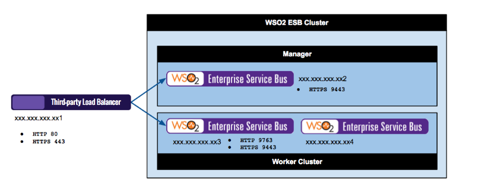

Instalar ESB en Cluster
======================

Toda esta informacion es de la pagina oficial de WSO2 para ESB.

Esta seccion describe como se configura WSO2 ESB worker/manager separados en un cluster. La siguiente seccion le suministra informacion e instrucciones de como configurar el cluster.

IMPORTANTE: cuando configure productos WSO2 en cluster, es necesario que use una IP en especifico y no localhost o el nombre DNS del Host en las configuraciones. 

Worker/manager Separados en cluster
+++++++++++++++++++++++++++++++++++

En esta parte hay tres WSO2 ESB nodes, un nodo actua como manager y los otros dos nodos actuan como worker para la alta disponibilidad y servir los servicios para los requests. En esta parte, permitiremos el acceso a la consola admin a traves de un load balancer al manager. Adicionalmente los servicios de requests estaran direccionados a los nodos workers a traves del load balancer. la siguiente imagen explica las partes del despliegue del esenario del cluster que seguiremos.

Aqui usamos dos nodos com conocidos como miembros, un como manager y los otros dos como nodos worker. Esto siempre es recomendado usar

Tenga en mente:
Los pasos de configuracion de este documento asumen que el default es el puerto 80 y 443 por el load balancer para este WSO2 ESB cluster. Si algun otro puerto es usado distintos a los defaults, remplace los puertos correspondientes.

Ya con lo de arriba en mente, tome en cuenta lo siguiente:
Los puertos en el Load balancer son el 80 y 443 indicados para el despliegue.
Los Requests HTTP hacia los nodos worker usan http://xxx.xxx.xxx.xx3/<service> via HTTP 80 port.
Los Requests HTTPS hacia los nodos worker usan https://xxx.xxx.xxx.xx3/<service> via HTTPS 443 port.
El acceso a la consola del Manager es por https://xxx.xxx.xxx.xx2/carbon via HTTPS 443 port
En WSO2 ESB cluster, la direccion de servicio de los Requests en los nodos worker para el PassThrough se hace por los puertos (8280 and 8243) y se puede haceder al Management Console usando el HTTPS 9443 port.

Crear los certificados SSL
++++++++++++++++++++++++++

Crear los certificados SSL para el manager y los nodos worker::

	Create the Server Key.
	$sudo openssl genrsa -des3 -out server.key 1024

	Certificate Signing Request.
	$sudo openssl req -new -key server.key -out server.csr

	Remove the password.
	$sudo cp server.key server.key.org

	$sudo openssl rsa -in server.key.org -out server.key
	Sign your SSL Certificate.

	$sudo openssl x509 -req -days 365 -in server.csr -signkey server.key -out server.crt

Mientras este creando las Keys, coloque el nombre del Host (esb.wso2.com or mgt.esb.wso2.com) como el del common name.

Configurar la Base de Datos
++++++++++++++++++++++++++++

Vea la siguiente configuracion_. .. _ ..crearproxyesb.rst 
para informacion de como se configura la Base de Datos para el cluster. La configuracion del datasource debe ser realizada en el archivo <PRODUCT_HOME>/repository/conf/datasources/master-datasources.xml para el manager y los nodos worker. Se puede tener configurado una base de datos para el shared registry y sus detalles en el archivo <PRODUCT_HOME>/repository/conf/registry.xml

