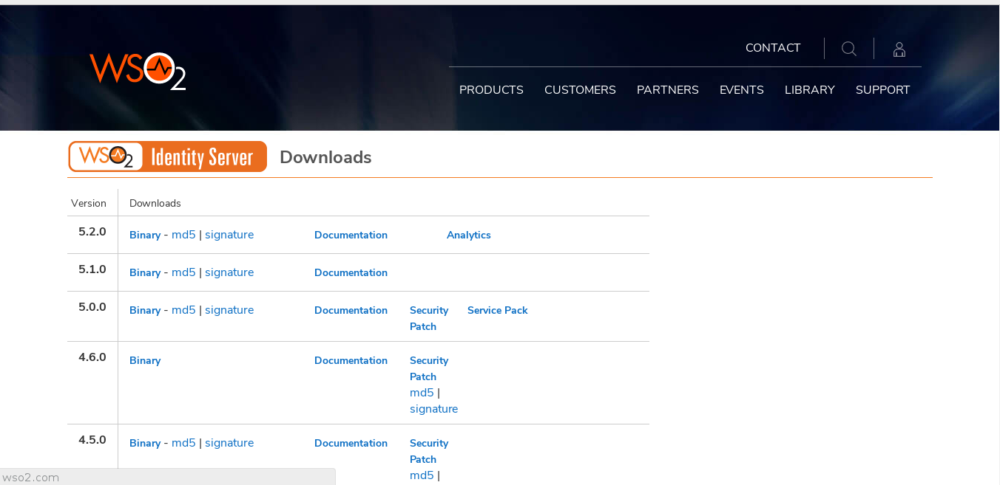
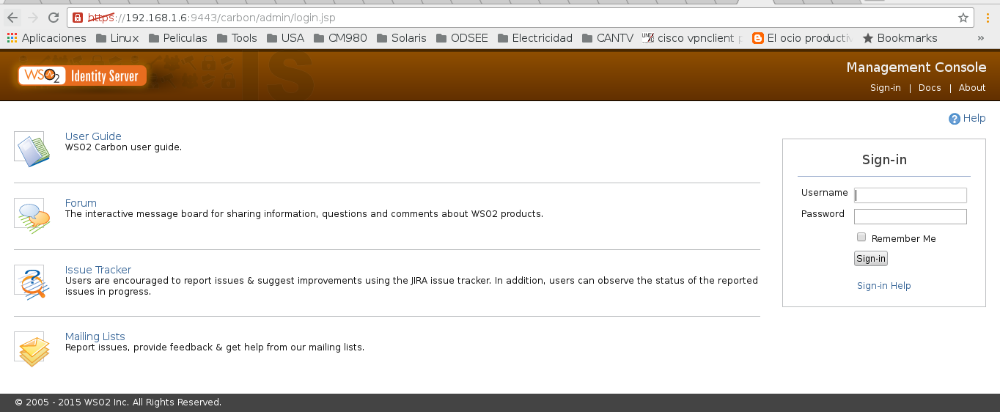

Instalar IS
==============

Descargar el paquete de IS http://wso2.com/more-downloads/identity-server, en este ejemplo utilizaremos la version 5.1.0

Antes de continuar debemos tener instalado java. Descarga java y lo instalas ::

	# rpm -ivh /tmp/jdk-8u101-linux-x64.rpm

	# java -version
	java version "1.8.0_101"
	Java(TM) SE Runtime Environment (build 1.8.0_101-b13)
	Java HotSpot(TM) 64-Bit Server VM (build 25.101-b13, mixed mode)

Instalamos Apache y lo iniciamos::

	# yum install httpd -y

Instalamos MYSQL y lo iniciamos para que pueda almacenar metadata del wso2is::

	# yum install mysql-server -y
	
	# /etc/init.d/mysqld start

Lo configuramos para tener la clave de root ::

	# mysql_secure_installation 

	NOTE: RUNNING ALL PARTS OF THIS SCRIPT IS RECOMMENDED FOR ALL MySQL
		  SERVERS IN PRODUCTION USE!  PLEASE READ EACH STEP CAREFULLY!

	In order to log into MySQL to secure it, we'll need the current
	password for the root user.  If you've just installed MySQL, and
	you haven't set the root password yet, the password will be blank,
	so you should just press enter here.

	Enter current password for root (enter for none): 
	OK, successfully used password, moving on...

	Setting the root password ensures that nobody can log into the MySQL
	root user without the proper authorisation.

	You already have a root password set, so you can safely answer 'n'.

	Change the root password? [Y/n] y
	New password: r00tme
	Re-enter new password: r00tme
	Password updated successfully!
	Reloading privilege tables..
	 ... Success!

	By default, a MySQL installation has an anonymous user, allowing anyone
	to log into MySQL without having to have a user account created for
	them.  This is intended only for testing, and to make the installation
	go a bit smoother.  You should remove them before moving into a
	production environment.

	Remove anonymous users? [Y/n] 
	 ... Success!

	Normally, root should only be allowed to connect from 'localhost'.  This
	ensures that someone cannot guess at the root password from the network.

	Disallow root login remotely? [Y/n] 
	 ... Success!

	By default, MySQL comes with a database named 'test' that anyone can
	access.  This is also intended only for testing, and should be removed
	before moving into a production environment.

	Remove test database and access to it? [Y/n] 
	 - Dropping test database...
	ERROR 1008 (HY000) at line 1: Can't drop database 'test'; database doesn't exist
	 ... Failed!  Not critical, keep moving...
	 - Removing privileges on test database...
	 ... Success!

	Reloading the privilege tables will ensure that all changes made so far
	will take effect immediately.

	Reload privilege tables now? [Y/n] 
	 ... Success!

	Cleaning up...

	All done!  If you've completed all of the above steps, your MySQL
	installation should now be secure.

	Thanks for using MySQL!

Ahora creamos una base de datos para que wso2 la utilice para los registros y usuarios ::

	# mysql -u root -p
	Enter password: r00tme
	Welcome to the MySQL monitor.  Commands end with ; or \g.
	Your MySQL connection id is 12
	Server version: 5.1.73 Source distribution

	Copyright (c) 2000, 2013, Oracle and/or its affiliates. All rights reserved.

	Oracle is a registered trademark of Oracle Corporation and/or its
	affiliates. Other names may be trademarks of their respective
	owners.

	Type 'help;' or '\h' for help. Type '\c' to clear the current input statement.

	mysql> show databases;
	+--------------------+
	| Database           |
	+--------------------+
	| information_schema |
	| mysql              |
	+--------------------+
	2 rows in set (0.00 sec)

	mysql> create database WSO2LOCAL_DB;
	Query OK, 1 row affected (0.00 sec)

	mysql> show databases;
	+--------------------+
	| Database           |
	+--------------------+
	| information_schema |
	| WSO2LOCAL_DB       |
	| mysql              |
	+--------------------+
	3 rows in set (0.00 sec)

	mysql> 

La base de datos estara sin tablas, pero hay dos formas de cargar dicha informacion y poblarla, una es utilizando el script que le corresponda al manejador de base de datos, que estan en el directorio "dbscripts", la otra forma es ejecutando toda la configuracion y cuando se vaya inicializar el wso2is con wso2server.sh se le pasa el parametro "-Dsetup". Nosotro utilizaremos la segunda opcion.

Vamos a crear un usuario y con el hacemos absolutamente toda la instalacion, configuracion y puesta en marcha::

	# useradd wso2
	# passwd wso2

Hacemos inicio de sesion con el usuario creado y con el ejecutamos todo el proceso.

Creamos la configuracion del las variables de entorno requerida JAVA_HOME, IS_HOME y del PATH ::

	# vi .bash_profile

	# Get the aliases and functions
	if [ -f ~/.bashrc ]; then
		    . ~/.bashrc
	fi

	# User specific environment and startup programs

	export JAVA_HOME=/usr/java/jdk1.8.0_101

	export IS_HOME=/opt/wso2/wso2is-5.1.0

	PATH=$PATH:$HOME/bin:$IS_HOME/bin

	export PATH

Cargamos los cambios ejecutados ::

	$ . .bash_profile

Creamos la carpeta de wso2 y verificamos que tenga los permisos para el usuario creado ::

	$ sudo mkdir /opt/wso2
	$ ls -l /opt/
	total 4
	drwxr-xr-x. 2 wso2 wso2 4096 jul 10 18:31 wso2

Descomprimimos el instalador en la carpeta creada ::

	# unzip  wso2is-5.1.0.zip -d /opt/wso2/

Ahora debemos descargar el driver de mysql "mysql-connector-java-5.0.8-bin.jar" desde "http://wso2.com/library/150/"

El connector de mysql lo movemos en "/opt/wso2/wso2is-5.1.0/repository/components/lib/"

	$ mv mysql-connector-java-5.0.8-bin.jar /opt/wso2/wso2is-5.1.0/repository/components/lib/

Desde la pagina oficial "https://docs.wso2.com/display/IS500/Setting+up+MySQL" sacamos el siguiente string de conexion que utilizaremos.::

	<datasource>
		   <name>WSO2_CARBON_DB</name>
		   <description>The datasource used for registry and user manager</description>
		   <jndiConfig>
		       <name>jdbc/WSO2CarbonDB</name>
		   </jndiConfig>
		   <definition type="RDBMS">
		       <configuration>
		           <url>jdbc:mysql://localhost:3306/regdb</url>
		           <username>regadmin</username>
		           <password>regadmin</password>
		           <driverClassName>com.mysql.jdbc.Driver</driverClassName>
		           <maxActive>80</maxActive>
		           <maxWait>60000</maxWait>
		           <minIdle>5</minIdle>
		           <testOnBorrow>true</testOnBorrow>
		           <validationQuery>SELECT 1</validationQuery>
		           <validationInterval>30000</validationInterval>
		           <defaultAutoCommit>false</defaultAutoCommit>
		       </configuration>
		   </definition>
	</datasource>

Editamos el archivo "master-datasources.xml" que esta en la ruta "/opt/wso2/wso2is-5.1.0/repository/conf/datasources" y comentamos el datasource que apunta a la base de datos h2 y colocamos el que nos copiamos de wso2 anteriormente. Comentamos este::

       <!--
        <datasource>
            <name>WSO2_CARBON_DB</name>
            <description>The datasource used for registry and user manager</description>
            <jndiConfig>
                <name>jdbc/WSO2CarbonDB</name>
            </jndiConfig>
            <definition type="RDBMS">
                <configuration>
                    <url>jdbc:h2:repository/database/WSO2CARBON_DB;DB_CLOSE_ON_EXIT=FALSE;LOCK_TIMEOUT=60000</url>
                    <username>wso2carbon</username>
                    <password>wso2carbon</password>
                    <driverClassName>org.h2.Driver</driverClassName>
                    <maxActive>50</maxActive>
                    <maxWait>60000</maxWait>
                    <testOnBorrow>true</testOnBorrow>
                    <validationQuery>SELECT 1</validationQuery>
                    <validationInterval>30000</validationInterval>
                    <defaultAutoCommit>false</defaultAutoCommit>
                </configuration>
            </definition>
        </datasource>
        -->

Agregamos este ::

	<datasource>
		   <name>WSO2_CARBON_DB</name>
		   <description>The datasource used for registry and user manager</description>
		   <jndiConfig>
		       <name>jdbc/WSO2CarbonDB</name>
		   </jndiConfig>
		   <definition type="RDBMS">
		       <configuration>
		           <url>jdbc:mysql://localhost:3306/WSO2LOCAL_DB</url>
		           <username>root</username>
		           <password>r00tme</password>
		           <driverClassName>com.mysql.jdbc.Driver</driverClassName>
		           <maxActive>80</maxActive>
		           <maxWait>60000</maxWait>
		           <minIdle>5</minIdle>
		           <testOnBorrow>true</testOnBorrow>
		           <validationQuery>SELECT 1</validationQuery>
		           <validationInterval>30000</validationInterval>
		           <defaultAutoCommit>false</defaultAutoCommit>
		       </configuration>
		   </definition>
	</datasource>

Ahora iniciamos wso2 con el parametro "-Dsetup" para que poble la base de datos.::

	$ /opt/wso2/wso2is-5.1.0/bin/wso2server.sh -Dsetup

Al culminar la carga del wso2is el nos lo indica y nos suministra el link para la consola::

[2017-07-10 19:35:16,061]  INFO {org.wso2.carbon.core.internal.StartupFinalizerServiceComponent} -  WSO2 Carbon started in 73 sec
[2017-07-10 19:35:17,135]  INFO {org.wso2.carbon.ui.internal.CarbonUIServiceComponent} -  Mgt Console URL  : https://localhost:9443/carbon/

Listo con esto ya podemos ir a la consola web, el usuario es "admin" y la clave "admin"

