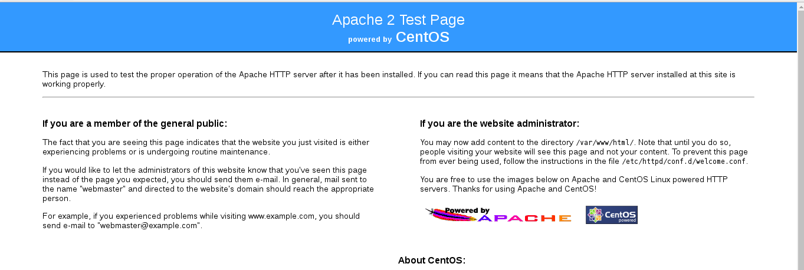
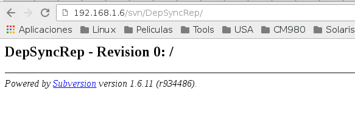

Instalar IS en Cluster
======================

Instalamos dos nodos con wso2is. uno de los nodos sera el manager y el otro sera el worker. En el manager vamos a instalar las base de datos (Registro local, usuarios locales , registros compartidos, usuarios compartidos) y el LDAP.

No olvides Iptables y SELinux...!!

Configurar el archivo hosts en todos los nodos::

	# sudo vi /etc/hosts
	127.0.0.1   localhost localhost.local
	::1         localhost localhost.localdomain localhost6 localhost6.localdomain6

	10.134.4.101    wso2is01 wso2is01.local
	10.134.4.102    wso2is02 wso2is02.local

	10.134.4.101    srv-is-manager-01
	10.134.4.102    srv-is-worker-01
	10.134.4.101    svn.local
	10.134.4.101    is.manager.local

Cofigurar las base de datos para cada uno de los nodos y las base de datos compartidas.

Base de datos que utilizaremos.::

	REGISTRY_LOCAL_DB_MANAGER
	REGISTRY_LOCAL_DB_WORKER
	SHARED_USER_DB_IS
	SHARED_REGISTRY_DB_IS

Instalamos mysql-server unicamente en el nodo que sera el manager y creamos las base de datos y le otorgamos los permisos::

	$ mysql -u root -p
	Enter password: r00tme
	Welcome to the MySQL monitor.  Commands end with ; or \g.
	Your MySQL connection id is 3
	Server version: 5.1.73 Source distribution

	Copyright (c) 2000, 2013, Oracle and/or its affiliates. All rights reserved.

	Oracle is a registered trademark of Oracle Corporation and/or its
	affiliates. Other names may be trademarks of their respective
	owners.

	Type 'help;' or '\h' for help. Type '\c' to clear the current input statement.

	mysql> show databases;
	+--------------------+
	| Database           |
	+--------------------+
	| information_schema |
	| WSO2LOCAL_DB       |
	| mysql              |
	+--------------------+
	3 rows in set (0.00 sec)

	mysql> create database REGISTRY_LOCAL_DB_MANAGER;
	Query OK, 1 row affected (0.01 sec)

	mysql> create database REGISTRY_LOCAL_DB_WORKER;
	Query OK, 1 row affected (0.00 sec)

	mysql> create database SHARED_USER_DB_IS;
	Query OK, 1 row affected (0.00 sec)

	mysql> create database SHARED_REGISTRY_DB_IS;
	Query OK, 1 row affected (0.00 sec)

	mysql> show databases;
	+---------------------------+
	| Database                  |
	+---------------------------+
	| information_schema        |
	| REGISTRY_LOCAL_DB_MANAGER |
	| REGISTRY_LOCAL_DB_WORKER  |
	| SHARED_REGISTRY_DB_IS     |
	| SHARED_USER_DB_IS         |
	| WSO2LOCAL_DB              |
	| mysql                     |
	+---------------------------+
	7 rows in set (0.00 sec)

	mysql> 

Otorgarmos los permisos unicamente locales para que el Manager pueda poblar su base de datos::

	mysql> GRANT ALL PRIVILEGES ON REGISTRY_LOCAL_DB_MANAGER.* TO root@'%' with grant option;
	Query OK, 0 rows affected (0.00 sec)

	mysql> GRANT ALL PRIVILEGES ON SHARED_USER_DB_IS.* TO root@'%' with grant option;
	Query OK, 0 rows affected (0.00 sec)

	mysql> GRANT ALL PRIVILEGES ON SHARED_REGISTRY_DB_IS.* TO root@'%' with grant option;
	Query OK, 0 rows affected (0.00 sec)

	mysql> 

Ahora los permisos para mysql acepte conexiones remotas y el worker pueda poblar su base de datos y las compartidas::

	mysql> GRANT ALL PRIVILEGES ON REGISTRY_LOCAL_DB_WORKER.* TO root@'10.134.4.102' identified by 'r00tme' with grant option;
	Query OK, 0 rows affected (0.00 sec)

	mysql> GRANT ALL PRIVILEGES ON SHARED_USER_DB_IS.* TO root@'10.134.4.102' identified by 'r00tme' with grant option;
	Query OK, 0 rows affected (0.00 sec)

	mysql> GRANT ALL PRIVILEGES ON SHARED_REGISTRY_DB_IS.* TO root@'10.134.4.102' identified by 'r00tme' with grant option;
	Query OK, 0 rows affected (0.00 sec)

	mysql> 

Aplicamos y certificamos la configuracion.::

	mysql> flush privileges;
	Query OK, 0 rows affected (0.00 sec)

	mysql> use mysql;
	Reading table information for completion of table and column names
	You can turn off this feature to get a quicker startup with -A

	Database changed
	mysql> select user,password,host from user;
	+------+-------------------------------------------+------------------+
	| user | password                                  | host             |
	+------+-------------------------------------------+------------------+
	| root | *841E9705B9F4BD3195B7314CA58A7E3B3B349F71 | localhost        |
	| root | *841E9705B9F4BD3195B7314CA58A7E3B3B349F71 | srv-is-worker-01 |
	| root | *841E9705B9F4BD3195B7314CA58A7E3B3B349F71 | 127.0.0.1        |
	| root |                                           | %                |
	+------+-------------------------------------------+------------------+
	4 rows in set (0.00 sec)

	mysql> exit
	Bye

Que MYSQL escuche por todas las IP::

	$ vi /etc/my.cnf

	[mysqld]
	datadir=/var/lib/mysql
	socket=/var/lib/mysql/mysql.sock
	user=mysql
	# Disabling symbolic-links is recommended to prevent assorted security risks
	symbolic-links=0
	bind-address=0.0.0.0

[mysqld_safe]
log-error=/var/log/mysqld.log
pid-file=/var/run/mysqld/mysqld.pid

[mysqld_safe]
log-error=/var/log/mysqld.log
pid-file=/var/run/mysqld/mysqld.pid

Instalamos y configuramos SVN y el APACHE, que son fundamental para los despliegues centralizados del Cluster.::

	# mkdir -p /opt/svn/repos

	# yum install subversion mod_dav_svn httpd -y

	# svn --version
		svn, versión 1.6.11 (r934486)

Creamos el repositorio de SVN.::

	# svnadmin create /opt/svn/repos/DepSyncRep

	# chown -R apache:apache /opt/svn/repos

Creamos los usuarios que utilizara el wso2 para el SVN.::

	# sudo htpasswd -cm /etc/svnpasswd wso2svn
	New password: wso2svn
	Re-type new password: wso2svn
	Adding password for user wso2svn

	# sudo htpasswd -m /etc/svnpasswd ismng01
	New password: svnIsmng01
	Re-type new password: svnIsmng01
	Adding password for user ismng01

	# sudo htpasswd -m /etc/svnpasswd isnode01
	New password: svnIswrk01
	Re-type new password: svnIswrk01
	Adding password for user isnode01

Certificamos que el SVN tenga los usuarios creados.::

	# cat /etc/svnpasswd
	  wso2svn:$apr1$8mr5bN/l$50.rj5q3GXuzbxGK7TtQX0
	  ismng01:$apr1$ZBY8Y8l0$yLzVXcsVJV0DmJn1ULrvO1
	  isnode01:$apr1$LKrZrUB.$hSs9BHy2nWxBDBqrtlipz/

Modificamos el virtual Host en apache para SVN.::

	# vi /etc/httpd/conf.d/subversion.conf
	<Location /svn>
	  DAV svn 
	  SVNParentPath /opt/svn/repos
	  AuthType Basic
	  AuthName "WSO2 repo"
	  AuthUserFile /etc/svnpasswd
	  Require valid-user
	</Location>

Reiniciamos el Apache.::

	# /etc/init.d/httpd restart

Verificamos que apache este operativo "http://srv-is-manager-01"

Verificamos que podemos ingresar al repositorio "http://srv-is-manager-01/svn/DepSyncRep/", el usuario y contraseña es cualquiera de los tres usuarios que creamos anteriormente con el comando "htpasswd", ponemos un tail para ver si hay errores.::

	# tail -f /var/log/httpd/error_log

Descargamos los siguientes jar que son utilizados para el SVN y el SSH, "https://docs.wso2.com/display/CLUSTER420/SVN-Based+Deployment+Synchronizer+for+Carbon+4.2.0-Based+Products":

* svnkit-all-1.8.7.wso2v1.jar
* trilead-ssh2-1.0.0-build215.jar

El archivo "svnkit-all-1.8.7.wso2v1.jar" lo copiamos en el directorio "WSO2_MANAGER_HOME/repository/components/dropins" y "trilead-ssh2-1.0.0-build215.jar" en el directorio "WSO2_MANAGER_HOME/repository/components/lib".::

	$ mv svnkit-all-1.8.7.wso2v1.jar /opt/wso2/wso2is-5.1.0/repository/components/dropins/
	$ mv trilead-ssh2-1.0.0-build215.jar /opt/wso2/wso2is-5.1.0/repository/components/lib/

Editar y descomentar en el archivo svnserve.conf los siguientes atributos (Solo en nodo manager).::

	# vi /opt/svn/repos/DepSyncRep/conf/svnserve.conf
	  anon-access = none
	  auth-access = write
	  password-db = passwd
	

	# vi /opt/svn/repos/DepSyncRep/conf/svnserve.conf/passwd		
	  wso2svn:wso2svn
	  ismng01:svnIsmng01
	  isnode01:svnIswrk01

Procedemos a realizar las configuraciones para el Cluster.
+++++++++++++++++++++++++++++++++++++++++++++++++++++++++++

Establecer Host y el management Host en nodo Manager::
	
	$ vi /opt/wso2/wso2is-5.2.0/repository/conf/carbon.xml	
		<HostName>srv-is-manager-01</HostName>
		<MgtHostName>is.manager.local</MgtHostName>

Establecer Host y el management Host en nodo Worker::
	
	$ vi /opt/wso2/wso2is-5.2.0/repository/conf/carbon.xml	
		<HostName>srv-is-worker-01</HostName>
		<MgtHostName>is.manager.local</MgtHostName>

En el wso2 IS Master::

	vi /opt/wso2/wso2is-5.1.0/repository/conf/datasources/master-datasources.xml

	<!-- Esta es la BD para los registros locales del Manager -->
	<datasource>
	<name>REGISTRY_LOCAL_DB</name>
	<description>The datasource used for local registry</description>
	<jndiConfig>
		<name>jdbc/WSO2CarbonDB</name>
	</jndiConfig>
	<definition type="RDBMS">
		<configuration>
			<url>jdbc:mysql://localhost:3306/REGISTRY_LOCAL_DB_MANAGER?autoReconnect=true</url>
			<username>root</username>
			<password>r00tme</password>
			<driverClassName>com.mysql.jdbc.Driver</driverClassName>
			<maxActive>50</maxActive>
			<maxWait>60000</maxWait>
			<testOnBorrow>true</testOnBorrow>
			<validationQuery>SELECT 1</validationQuery>
			<validationInterval>30000</validationInterval>
			<defaultAutoCommit>true</defaultAutoCommit>
		</configuration>
	</definition>
	</datasource>
	
	<!-- Esta es la BD para los registros Compartidos del Cluster -->
	<datasource>
	<name>SHARED_REGISTRY_DB_IS</name>
	<description>The datasource used for registry- config/governance</description>
	<jndiConfig>
		<name>jdbc/WSO2RegistryDB</name>
	</jndiConfig>
	<definition type="RDBMS">
		<configuration>
			<url>jdbc:mysql://localhost:3306/SHARED_REGISTRY_DB_IS?autoReconnect=true</url>
			<username>root</username>
			<password>r00tme</password>
			<driverClassName>com.mysql.jdbc.Driver</driverClassName>
			<maxActive>50</maxActive>
			<maxWait>60000</maxWait>
			<testOnBorrow>true</testOnBorrow>
			<validationQuery>SELECT 1</validationQuery>
			<validationInterval>30000</validationInterval>
			<defaultAutoCommit>true</defaultAutoCommit>
		</configuration>
	</definition>
	</datasource>
	
	<!-- Esta es la BD para los Usuarios manager Compartidos del Cluster -->
	<datasource>
	<name>SHARED_USER_DB_IS</name>
	<description>The datasource used for registry and user manager</description>
	<jndiConfig>
		<name>jdbc/WSO2UMDB</name>
	</jndiConfig>
	<definition type="RDBMS">
		<configuration>
			<url>jdbc:mysql://localhost:3306/SHARED_USER_DB_IS?autoReconnect=true</url>
			<username>root</username>
			<password>r00tme</password>
			<driverClassName>com.mysql.jdbc.Driver</driverClassName>
			<maxActive>50</maxActive>
			<maxWait>60000</maxWait>
			<testOnBorrow>true</testOnBorrow>
			<validationQuery>SELECT 1</validationQuery>
			<validationInterval>30000</validationInterval>
			<defaultAutoCommit>true</defaultAutoCommit>
		</configuration>
	</definition>
	</datasource>

En el wso2 IS Worker::

	vi /opt/wso2/wso2is-5.1.0/repository/conf/datasources/master-datasources.xml

	<!-- Esta es la BD para los registros locales del Worker -->
	<datasource>
	<name>REGISTRY_LOCAL_DB</name>
	<description>The datasource used for local registry</description>
	<jndiConfig>
		<name>jdbc/WSO2CarbonDB</name>
	</jndiConfig>
	<definition type="RDBMS">
		<configuration>
			<url>jdbc:mysql://srv-is-manager-01:3306/REGISTRY_LOCAL_DB_WORKER?autoReconnect=true</url>
			<username>root</username>
			<password>r00tme</password>
			<driverClassName>com.mysql.jdbc.Driver</driverClassName>
			<maxActive>50</maxActive>
			<maxWait>60000</maxWait>
			<testOnBorrow>true</testOnBorrow>
			<validationQuery>SELECT 1</validationQuery>
			<validationInterval>30000</validationInterval>
			<defaultAutoCommit>true</defaultAutoCommit>
		</configuration>
	</definition>
	</datasource>
	
	<!-- Esta es la BD para los registros Compartidos del Cluster -->
	<datasource>
	<name>SHARED_REGISTRY_DB_IS</name>
	<description>The datasource used for registry- config/governance</description>
	<jndiConfig>
		<name>jdbc/WSO2RegistryDB</name>
	</jndiConfig>
	<definition type="RDBMS">
		<configuration>
			<url>jdbc:mysql://srv-is-manager-01:3306/SHARED_REGISTRY_DB_IS?autoReconnect=true</url>
			<username>root</username>
			<password>r00tme</password>
			<driverClassName>com.mysql.jdbc.Driver</driverClassName>
			<maxActive>50</maxActive>
			<maxWait>60000</maxWait>
			<testOnBorrow>true</testOnBorrow>
			<validationQuery>SELECT 1</validationQuery>
			<validationInterval>30000</validationInterval>
			<defaultAutoCommit>true</defaultAutoCommit>
		</configuration>
	</definition>
	</datasource>
	
	<!-- Esta es la BD para los Usuarios manager Compartidos del Cluster -->
	<datasource>
	<name>SHARED_USER_DB_IS</name>
	<description>The datasource used for registry and user manager</description>
	<jndiConfig>
		<name>jdbc/WSO2UMDB</name>
	</jndiConfig>
	<definition type="RDBMS">
		<configuration>
			<url>jdbc:mysql://srv-is-manager-01:3306/SHARED_USER_DB_IS?autoReconnect=true</url>
			<username>root</username>
			<password>r00tme</password>
			<driverClassName>com.mysql.jdbc.Driver</driverClassName>
			<maxActive>50</maxActive>
			<maxWait>60000</maxWait>
			<testOnBorrow>true</testOnBorrow>
			<validationQuery>SELECT 1</validationQuery>
			<validationInterval>30000</validationInterval>
			<defaultAutoCommit>true</defaultAutoCommit>
		</configuration>
	</definition>
	</datasource>

Cada nodo del cluster modificamos (/opt/wso2/wso2is-5.1.0/repository/conf/carbon.xml) para cabiar el usuario admin y para decirle en que BD se almacenaran ahora los usuarios.::

	$ vi /opt/wso2/wso2is-5.1.0/repository/conf/user-mgt.xml 
	   <UserName>useradmin</UserName>
	   <Password>r00tme</Password>

	   <Property name="dataSource">jdbc/WSO2UMDB</Property>

Establecer DeploymentSynchronizer en nodo Manager "/opt/wso2/wso2is-5.1.0/repository/conf/carbon.xml".::

	$ vi /opt/wso2/wso2is-5.1.0/repository/conf/carbon.xml
		<DeploymentSynchronizer>
		    <Enabled>true</Enabled>
		    <AutoCommit>true</AutoCommit>
		    <AutoCheckout>true</AutoCheckout>
		    <RepositoryType>svn</RepositoryType>
		    <SvnUrl>http://srv-is-manager-01/svn/DepSyncRep/</SvnUrl>
		    <SvnUser>ismng01</SvnUser>
		    <SvnPassword>svnIsmng01</SvnPassword>
		    <SvnUrlAppendTenantId>true</SvnUrlAppendTenantId>
		</DeploymentSynchronizer>

Establecer DeploymentSynchronizer en nodo Worker "/opt/wso2/wso2is-5.1.0/repository/conf/carbon.xml".::

	$ vi /opt/wso2/wso2is-5.1.0/repository/conf/carbon.xml
		<DeploymentSynchronizer>
		    <Enabled>false</Enabled>
		    <AutoCommit>false</AutoCommit>
		    <AutoCheckout>true</AutoCheckout>
		    <RepositoryType>svn</RepositoryType>
		    <SvnUrl>http://srv-is-manager-01/svn/DepSyncRep/</SvnUrl>
		    <SvnUser>isnode01</SvnUser>
		    <SvnPassword>svnIswrk01</SvnPassword>
		    <SvnUrlAppendTenantId>true</SvnUrlAppendTenantId>
		</DeploymentSynchronizer>

Establecer registry en nodo Manager "/opt/wso2/wso2is-5.1.0/repository/conf/registry.xml".::

	$ vi /opt/wso2/wso2is-5.1.0/repository/conf/registry.xml

	<currentDBConfig>wso2registry</currentDBConfig>
		<readOnly>false</readOnly>
		<enableCache>true</enableCache>
		<registryRoot>/</registryRoot>
		<dbConfig name="wso2registry">
		    <dataSource>jdbc/WSO2CarbonDB</dataSource>
		</dbConfig>
	
		<dbConfig name="sharedregistry">
			<dataSource>jdbc/WSO2RegistryDB</dataSource>
		</dbConfig>

		<remoteInstance url="https://localhost:9443/registry">
			<id>isregid</id>
			<dbConfig>sharedregistry</dbConfig>
			<readOnly>false</readOnly>
			<enableCache>true</enableCache>
			<registryRoot>/</registryRoot>
		<cacheId>wso2db@jdbc:mysql://10.134.4.101:3306/REGISTRY_DB?autoReconnect=true</cacheId>
		</remoteInstance>

		<mount path="/_system/config" overwrite="true">
			<instanceId>isregid</instanceId>
			<targetPath>/_system/isNodes</targetPath>
		</mount>

		<mount path="/_system/governance" overwrite="true">
			<instanceId>isregid</instanceId>
			<targetPath>/_system/governance</targetPath>
		</mount>

Establecer registry en nodo Worker "/opt/wso2/wso2is-5.1.0/repository/conf/registry.xml".::

	$ vi /opt/wso2/wso2is-5.1.0/repository/conf/registry.xml

		<currentDBConfig>wso2registry</currentDBConfig>
			<readOnly>false</readOnly>
			<enableCache>true</enableCache>
			<registryRoot>/</registryRoot>
			<dbConfig name="wso2registry">
				<dataSource>jdbc/WSO2CarbonDB</dataSource>
			</dbConfig>
		
		<dbConfig name="sharedregistry">
			<dataSource>jdbc/WSO2RegistryDB</dataSource>
		</dbConfig>

		<remoteInstance url="https://localhost:9443/registry">
			<id>isregid</id>
			<dbConfig>sharedregistry</dbConfig>
			<readOnly>true</readOnly>
			<enableCache>true</enableCache>
			<registryRoot>/</registryRoot>
		<cacheId>wso2db@jdbc:mysql://10.134.4.101:3306/REGISTRY_DB?autoReconnect=true</cacheId>
		</remoteInstance>

		<mount path="/_system/config" overwrite="true">
			<instanceId>isregid</instanceId>
			<targetPath>/_system/isNodes</targetPath>
		</mount>

		<mount path="/_system/governance" overwrite="true">
			<instanceId>isregid</instanceId>
			<targetPath>/_system/governance</targetPath>
		</mount>

Establecer cluster en nodo Manager "/opt/wso2/wso2is-5.2.0/repository/conf/axis2/axis2.xml".::

	$ vi /opt/wso2/wso2is-5.1.0/repository/conf/axis2/axis2.xml
                <clustering class="org.wso2.carbon.core.clustering.hazelcast.HazelcastClusteringAgent" enable="true">
                <parameter name="membershipScheme">wka</parameter>
                <parameter name="domain">wso2.is.cluster.org</parameter>
                <parameter name="localMemberHost">srv-is-manager-01</parameter>
                <parameter name="localMemberPort">4100</parameter>
                <property name="subDomain" value="mgt"/>
    
                <members>
                        <member>
                                <hostName>srv-is-worker-01</hostName>
                                <port>4100</port>
                        </member>
                </members>

Establecer cluster en nodo Worker "/opt/wso2/wso2is-5.2.0/repository/conf/axis2/axis2.xml".::

	$ vi /opt/wso2/wso2is-5.1.0/repository/conf/axis2/axis2.xml
                <clustering class="org.wso2.carbon.core.clustering.hazelcast.HazelcastClusteringAgent" enable="true">
                <parameter name="membershipScheme">wka</parameter>
                <parameter name="domain">wso2.is.cluster.org</parameter>
                <parameter name="localMemberHost">srv-is-worker-01</parameter>
                <parameter name="localMemberPort">4100</parameter>
                <property name="subDomain" value="worker"/>
    
                <members>
                        <member>
                                <hostName>srv-is-manager-01</hostName>
                                <port>4100</port>
                        </member>
                </members>

Inhabilitar en nodos worker LDAP interno "/opt/wso2/wso2is-5.1.0/repository/conf/identity/embedded-ldap.xml".::

	$ vi /opt/wso2/wso2is-5.1.0/repository/conf/identity/embedded-ldap.xml

		<Property name="enable">false</Property>

Editar el archivo user-mgt.xml en cada nodo Worker y cambiar ConnectionURL a nodo manager (LDAP embebido).::

	$ vi /opt/wso2/wso2is-5.1.0/repository/conf/user-mgt.xml

		<Property name="ConnectionURL">ldap://srv-is-manager-01:10389</Property>

Ejecutar luego del setup manager (opci\F3n final de ejecuci\F3n).::

$ /opt/wso2/wso2is-5.1.0/bin/wso2server.sh -Dsetup
