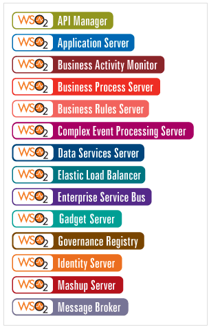

Introduccion wso2
===================

La plataforma WSO2 Carbon la componen un conjunto de productos que dan una solución completa al desarrollo de aplicaciones SOA:
++++++++++++++++++++++++++++++++++++++++++++++++++++++++++++++++++++++++++++++++++++++++++++++++++++++++++++++++++++++++++++++++

WSO2 es una plataforma 100% open source. Dentro de WSO2, encontramos WSO2 Carbon, un plataforma middleware con diferentes componentes que se adapta a cada empresa y a sus proyectos IT. ¿Qué compone el WSO2 Carbon?

La plataforma WSO2 Carbon está compuesto por diferentes componentes que ofrecen una gran variedad de funciones como vemos a continuación.

WS02 Application Server:
+++++++++++++++++++++++++

El WSO2 Application Server reúne y comunica las principales aplicaciones web. Algunas de sus características son:

* Soporta servicios JAX-WS -(WS-*) y JAX-RS (REST) y todos los estándares WS-*
* Se integra con WS02 BAM para monitorización y auditoría operacional
* Basado en Tomcat; que es un contenedor de Servlets, es decir un módulo para ejecutar servlets y/o páginas jsp en aplicaciones web
* Consola Web para la gestión y monitorización sencilla

WS02 Entreprise Service  Bus:
++++++++++++++++++++++++++++++

Este componente es capaz de integrar estándares y soportar todos los patrones de integración, lo que posibilita la interoperabilidad entre varios sistemas heterogéneos y entre aplicaciones de empresas. El WSO2 ESB se encarga de:

* Enrutado de mensajes: sobre cabeceras, contenido del mensaje, reglas.
* Mediación:filtros de masajes, listas de destinatarios,enriquecimiento del mensaje,etc.
* Transformación:XSLT 1.0/2.0, XPath, XQuery, Smooks.
* Gestión de la seguridad
* Clustering

WSO2 Business Process Server:
++++++++++++++++++++++++++++++

Gracias a este componente, los desarrolladles pueden desarrollar modelos y procedimientos con WS-BPEL y estándares BPMN. Este componente también sirve para la gestión de procesos empresariales y como un entorno de alojamiento SOA.  Algunas de las características y funcionalidades de este componente son:

* Permite desplegar procesos de negocio escritos EN WS-BPEL (soporta BPEL 2.0).
* Editor gráfico de procesos
* Proporciona una interface web gráfica para desplegar, gestionar y ver los procesos.
* Publicación de eventos a WSO2 Business Activity Monitor (WSO2 BAM) para monitorización de procesos y publicación de cuadros de mando.
* Versionado
* Cuadro de mandos de procesos activos, errores, instancias, etc.
* Auditoría gráfica de instancias.
* Despliegue en alta disponibilidad.

WSO2 Business Activity Monitor:
++++++++++++++++++++++++++++++++

Gracias al WSO2 Business Activity Monitor podemos monitorizar los indicadores clave de los procesos de negocio (BAM). Con el podemos:

* Encontrar herramientas para crear cuadros de mando personalizados sin necesidad de programar.
* Registra cualquier evento de negocio (datos de negocio, metadatos y correlaciones).
* Consola web sencilla para la gestión y monitorización de procesos.
* El producto proporciona una colección de estadísticas e indicadores estándar ya construidos sobre accesos y rendimiento.

WSO2 Complex Event Processing Server:
+++++++++++++++++++++++++++++++++++++

Permite definir procesos inteligentes como respuestas a secuencias de eventos.

Basado en JBoss Rules
Identifica los eventos más significativos, analiza su impacto y responde a los mismos en tiempo real.
Soporta múltiples tipos de brokers, incluyendo WS-Eventing y JMS.
WSO2 Data Services Server

El WSO2 Data Service Server Ofrece herramientas para un rápido desarrollo de servicios de acceso a datos, edición, configuración de recursos de datos, generación de operaciones CRUD contra esquemas de bases de datos y mapping de datos obtenidos de consultas a formatos XML. Además también nos ayudará a:

* Integrar con cualquier base de datos que disponga de un driver JDBC, soporta también fuentes de datos como CSV, Excel, ODS
* Combinar datos de múltiples fuentes en un solo servicio, crea servicios REST para operaciones CRUD
* Gestionar transacciones distribuidas entre diferentes bases de datos.
* Transformar datos vía XSLT y XQuery.
* Proporcionar validación para tipos de datos estándar (enteros, cadenas, fechas, etc.) y permite construir fácilmente validadores para datos más complejos.
* Generar WSDLs automáticamente para servicios de datos.

